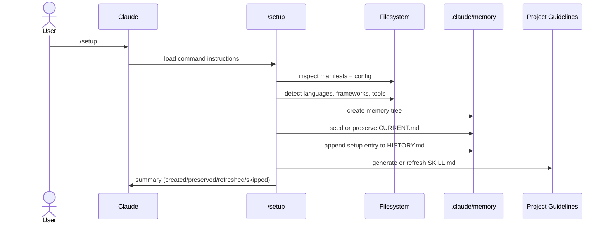
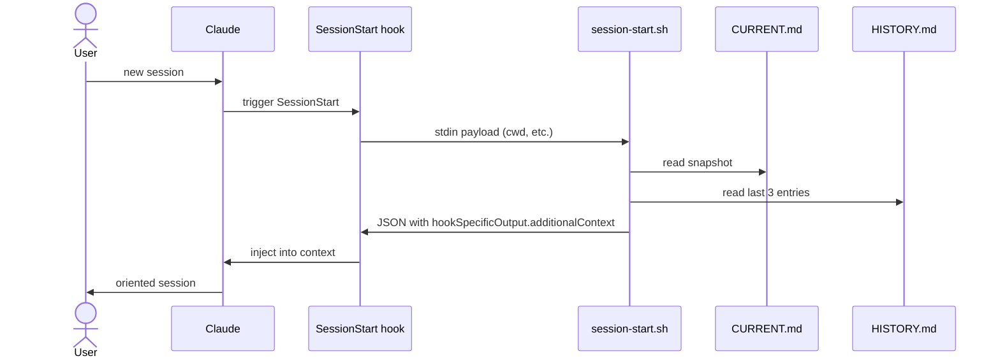
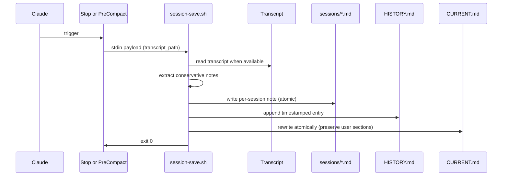
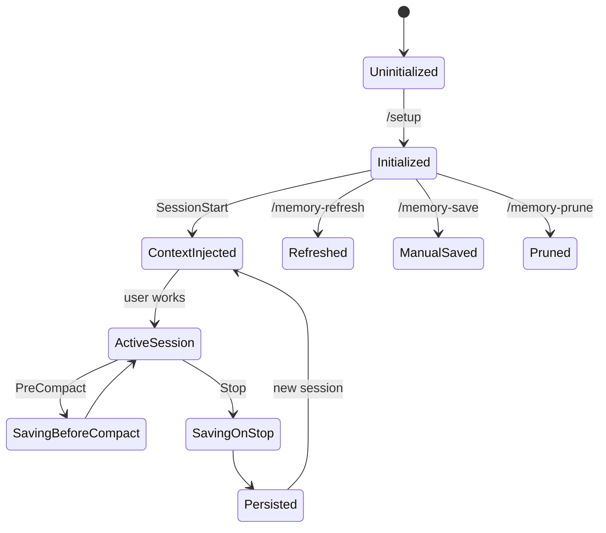

# Memplexor — Product Requirements Document

> **Plugin name:** `memplexor`
> **Version:** 0.1.0
> **Status:** MVP implementation

## Executive Summary

Memplexor is a Claude Code plugin that gives every project a durable, project-local
memory layer. It initializes a `.claude/memory/` workspace, generates project-specific
guidelines, injects recent project context at session start, and saves progress when
sessions end or context is compacted.

Sessions lose continuity across restarts, compaction, or long-running work. Memplexor
creates a repeatable memory convention so Claude orients itself before work begins and
preserves useful progress afterward.

## Problem

Developers repeatedly re-explain:
- What the project does, which stack/tools/conventions it uses
- What was done in previous sessions and what remains
- Which files, commands, workflows matter
- Which project-specific rules Claude should follow

Without durable memory, every new session starts cold → duplicated explanation,
inconsistent decisions, lost progress.

## Goals

- One-command setup via `/setup`
- Project-local storage under `.claude/memory/`
- Generate project-specific guidelines from real repository analysis
- Auto-inject project context on every new session
- Auto-save session progress on `Stop` and `PreCompact`
- Manual commands: `/memory-status`, `/memory-refresh`, `/memory-save`, `/memory-prune`
- Readable, editable, version-control-friendly files
- Preserve user-authored memory by default
- Idempotent setup/refresh
- No secrets, no excessive transcript content

## Non-Goals

- No cloud sync
- No replacement for git/issue trackers/PM tools
- No credentials, API keys, secrets storage
- No database, no long-running daemon
- No conflict with official Claude Code documentation
- No overwriting user-authored memory without explicit intent

## Target Users

- Solo developers across multiple sessions
- Teams wanting consistent project conventions for AI-assisted work
- Maintainers onboarding Claude Code into mature repos
- Multi-project developers across stacks
- Agentic workflows needing reliable orientation

## Core User Stories

- Run `/setup` once → Claude understands the repo + persistent memory created
- New sessions auto-remember where work was left
- Claude knows project conventions before editing
- Progress saved before compaction → important context not lost
- Inspect memory state without modifying it
- Refresh generated guidelines after stack changes
- Manually save a milestone or decision
- Prune/archive old session notes safely

## MVP Scope (delivered in 0.1.0)

- Plugin manifest (`.claude-plugin/plugin.json`)
- `/setup` slash command
- Hook registration (`hooks/hooks.json`)
- `SessionStart` context injection hook (`hooks/session-start.sh`)
- `Stop` session save hook (`hooks/session-save.sh`)
- `PreCompact` session save hook (same script)
- Project-local memory layout under `.claude/memory/`
- Project-guidelines skill (`skills/project-guidelines/SKILL.md`)
- Full command suite: `/setup`, `/memory-status`, `/memory-refresh`, `/memory-save`, `/memory-prune`
- README + this PRD
- Functional smoke validation in `/tmp/memplexor-test`

## Architecture

```mermaid
flowchart TD
    User[Developer] --> ClaudeCode[Claude Code]
    ClaudeCode --> PluginManifest[.claude-plugin/plugin.json]
    PluginManifest --> Commands[commands/*.md]
    PluginManifest --> HookConfig[hooks/hooks.json]
    PluginManifest --> Skills[skills/project-guidelines/SKILL.md]

    Commands --> SetupCmd[/setup]
    Commands --> StatusCmd[/memory-status]
    Commands --> RefreshCmd[/memory-refresh]
    Commands --> SaveCmd[/memory-save]
    Commands --> PruneCmd[/memory-prune]

    HookConfig --> SessionStartHook[SessionStart]
    HookConfig --> StopHook[Stop]
    HookConfig --> PreCompactHook[PreCompact]

    SessionStartHook --> SessionStartScript[hooks/session-start.sh]
    StopHook --> SessionSaveScript[hooks/session-save.sh]
    PreCompactHook --> SessionSaveScript

    SetupCmd --> MemoryTree[.claude/memory/]
    SessionStartScript --> MemoryTree
    SessionSaveScript --> MemoryTree

    MemoryTree --> CurrentCtx[context/CURRENT.md]
    MemoryTree --> History[progress/HISTORY.md]
    MemoryTree --> SessionNotes[sessions/*.md]

    CurrentCtx --> Injected[hookSpecificOutput.additionalContext]
    History --> Injected
    Injected --> ClaudeCode
```

## Plugin Package Layout

```
memplexor/
├── .claude-plugin/
│   └── plugin.json
├── commands/
│   ├── setup.md
│   ├── memory-status.md
│   ├── memory-refresh.md
│   ├── memory-save.md
│   └── memory-prune.md
├── hooks/
│   ├── hooks.json
│   ├── session-start.sh
│   └── session-save.sh
├── skills/
│   └── project-guidelines/
│       └── SKILL.md
├── templates/
│   ├── project-guidelines.SKILL.md
│   ├── CURRENT.md
│   └── HISTORY.md
├── docs/
│   └── PRD.md
└── README.md
```

## Project-Local Generated Layout

```
target-project/
└── .claude/
    ├── memory/
    │   ├── context/
    │   │   └── CURRENT.md
    │   ├── progress/
    │   │   └── HISTORY.md
    │   ├── sessions/
    │   │   └── 2026-05-27T16-43-37.md
    │   └── archive/
    │       └── (optional older memory)
    └── skills/
        └── project-guidelines/
            └── SKILL.md
```

## System Flows

### Initial Setup



### Session Start Context Injection



### Session Save (Stop / PreCompact)



### Manual Commands

```mermaid
flowchart TD
    Cmd[User runs slash command] --> Router{which?}
    Router --> Setup[/setup]
    Router --> Status[/memory-status]
    Router --> Refresh[/memory-refresh]
    Router --> Save[/memory-save]
    Router --> Prune[/memory-prune]
```

### Memory Lifecycle



## Data Model

### `.claude/memory/context/CURRENT.md`

Sections:
- `# Current Project Context`
- `Last updated` (ISO-8601)
- `Where We Are`
- `Recent Work`
- `Next Steps`
- `Open Questions` *(user-authored, preserved by save hook)*
- `Important Files`
- `Warnings or Constraints` *(user-authored, preserved by save hook)*

Rewritten atomically (tmp + rename) by setup, refresh, save hooks, save command.

### `.claude/memory/progress/HISTORY.md`

Append-only. Never rewritten during normal operation.

Entry shape:

```markdown
## 2026-05-27T14:30:00-04:00 — setup complete

* Initialized Claude project memory.
* Generated project guidelines skill.
* Registered session memory hooks.
* Next: start a new Claude Code session to verify context injection.
```

### `.claude/memory/sessions/{ISO-date}.md`

Per-session compact notes. Avoids full transcript dumps.

Sections:
- `# Session Notes`
- `Timestamp`
- `Hook Event`
- `Title`
- `Summary`
- `Files Touched`
- `Decisions Made`
- `Next Steps`
- `Transcript Source`

### `.claude/skills/project-guidelines/SKILL.md`

Generated rulebook. YAML frontmatter + sections:
- Detected stack
- Build / Test / Lint / Typecheck commands
- Code conventions
- Do / Don't rules
- Key directories
- Project-specific notes

## Command Specification

### `/setup`

Bootstrap. Flags: `--dry-run`, `--refresh`, `--force`, `--preserve-memory`, `--help`.

Behavior: detect root → inspect manifests (package.json, pyproject.toml, Cargo.toml,
go.mod, Gemfile, composer.json, Makefile, README, config files) → create memory tree
→ seed CURRENT.md if absent → append HISTORY setup entry → generate/refresh
project-guidelines SKILL.md → report created/preserved/refreshed/skipped.

Idempotency: re-runs preserve user-authored memory, do not duplicate setup entries,
refresh only generated files with the marker `Generated by Memplexor`. `--dry-run`
writes nothing.

### `/memory-status`

Read-only. Flags: `--verbose`, `--json`, `--help`.

Reports: setup state, CURRENT.md presence + last-updated, HISTORY entry count,
session note count, project-guidelines skill presence, hook config presence.
Recommends `/setup` or `/memory-refresh` when artifacts missing.

### `/memory-refresh`

Re-analyze project. Flags: `--skill`, `--context`, `--hooks`, `--all`,
`--dry-run`, `--force`, `--help`.

Refreshes generated artifacts. Preserves manual sections. Appends refresh entry to
HISTORY.md.

### `/memory-save`

Manual checkpoint. Flags: freeform text, `--title`, `--session-note`, `--help`.

Appends timestamped entry to HISTORY.md, updates CURRENT.md, optionally writes
per-session note. Refuses to write secrets.

### `/memory-prune`

Retention. Flags: `--keep-sessions N` (default 20), `--keep-history N` (default 100),
`--archive`, `--summarize`, `--dry-run`, `--help`.

Never deletes by default — prefers archive. Preserves CURRENT.md and recent
HISTORY. Appends pruning entry.

## Hook Specification

### `SessionStart` → `hooks/session-start.sh`

Inputs: stdin JSON payload (may contain `cwd`, `project_dir`, `workspace_dir`).
Fallback to `$CLAUDE_PROJECT_DIR` then `pwd`.

Reads: `.claude/memory/context/CURRENT.md`, `.claude/memory/progress/HISTORY.md`
(last 3 H2 entries).

Output: JSON `{"hookSpecificOutput": {"hookEventName": "SessionStart",
"additionalContext": "..."}}`.

Always includes: `Always consult .claude/memory/ before starting work; orient
yourself first.`

Missing memory → emits short notice to run `/setup`. Never fails the session.

### `Stop` → `hooks/session-save.sh`

Inputs: stdin JSON (`cwd`, `transcript_path`, `hook_event_name`).

Writes: append to HISTORY.md, atomic rewrite of CURRENT.md (preserving user
"Open Questions" + "Warnings or Constraints" sections), per-session note in
`sessions/{ISO-date}.md`.

### `PreCompact` → `hooks/session-save.sh`

Same script. Title indicates `pre-compact save`. Duplicate suppression within 60s
window via comparing latest H2 in HISTORY.md.

## Functional Requirements

- Plugin loads without errors in Claude Code.
- `/setup` bootstraps `.claude/memory/` tree.
- `/setup` is safe to re-run.
- SessionStart injection works when memory exists.
- SessionStart handles missing memory gracefully.
- Stop + PreCompact save conservatively.
- All rewrites are atomic (tmp + rename).
- HISTORY.md remains append-only.
- Generated skill reflects detected stack.
- Documentation explains install, setup, layout, hooks, commands, extension.

## Non-Functional Requirements

- **Reliability:** hooks fail open (always exit 0).
- **Portability:** bash + python3 only. python3 is the only hard dependency for
  JSON encoding/decoding inside hook scripts.
- **Safety:** no secrets, conservative transcript summarization.
- **Maintainability:** small files.
- **Transparency:** commands report what changed.
- **Performance:** hooks read only small files, never scan the full project.
- **Version control:** memory may be checked in or ignored — README documents both.

## Acceptance Criteria

- [x] Plugin manifest exists at `.claude-plugin/plugin.json`
- [x] `hooks/hooks.json` registers SessionStart, Stop, PreCompact
- [x] `hooks/session-start.sh` emits valid JSON with `additionalContext`
- [x] `hooks/session-start.sh` handles missing memory without failing
- [x] `hooks/session-save.sh` appends to HISTORY.md
- [x] `hooks/session-save.sh` rewrites CURRENT.md atomically
- [x] `hooks/session-save.sh` writes per-session note
- [x] `hooks/session-save.sh` duplicate suppression within 60s
- [x] `/setup`, `/memory-status`, `/memory-refresh`, `/memory-save`,
       `/memory-prune` commands authored
- [x] `skills/project-guidelines/SKILL.md` present
- [x] README documents install, usage, commands, hooks, memory layout
- [ ] End-to-end validation in real Claude Code session (deferred to Phase 14)

## Risks and Mitigations

| Risk | Mitigation |
|---|---|
| Official plugin schema differs from assumptions | Manifest fields match Claude Code plugin spec; hooks.json uses `${CLAUDE_PLUGIN_ROOT}` |
| Hook payload missing expected fields | Fallbacks: `$CLAUDE_PROJECT_DIR` then `pwd`; payload parsing wrapped in try/except |
| Transcript contains sensitive info | Hook extracts only file_path entries from tool_use blocks, last 15. No raw transcript dump. |
| Repeated hooks → noisy history | 60s duplicate suppression on same-title entries |
| Project-local skills path differs | Skill files live at `.claude/skills/<name>/SKILL.md` per Claude Code docs |
| `jq` unavailable | Hooks use `python3` for JSON; documented as the only hard dep |

## Assumptions (deviations from official docs, if any)

This implementation assumes:
- Plugin manifest path: `.claude-plugin/plugin.json`
- Hooks registered via plugin-relative `hooks/hooks.json` referenced from `plugin.json`
- Hook scripts receive payload as JSON on stdin
- SessionStart hook emits `{"hookSpecificOutput": {"hookEventName":
  "SessionStart", "additionalContext": "..."}}` to inject context
- Commands authored as `commands/<name>.md` with YAML frontmatter (`description`,
  `allowed-tools`)
- Skill files at `skills/<name>/SKILL.md` for plugin-shipped skills and
  `.claude/skills/<name>/SKILL.md` for project-local skills
- `${CLAUDE_PLUGIN_ROOT}` env var available inside hook command strings

If Claude Code documentation diverges, regenerate manifest + hooks.json + command
frontmatter accordingly. All other plugin internals are stable.

## Documentation Requirements (covered in README.md)

- What the plugin does
- Install instructions (local + marketplace)
- Setup instructions
- Command reference
- Hook behavior
- Memory layout
- File format examples
- Template customization
- Retention tuning
- Adding hooks
- Troubleshooting
- Security/privacy notes
- Version-control recommendations
